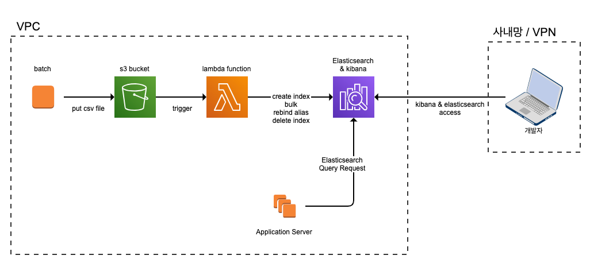

# Amazon Elasticsearch 를 이용한 공용 검색 클러스터 만들기.

## 목적 및 목표
검색팀에서는 설치형 ES로 검색엔진을 구성하여 서비스 하고 있음.
노드 관리, 인덱스 관리 등의 업무를 함께 맡고 있음.
타 팀에서도 검색 엔진을 쓰고 싶어 하는 니즈가 있음.
ES를 깔아주기도, 검색 팀 ES에 올리기도, 애매한 느낌적인 느낌으로 공동으로 사용 가능한 검색엔진을 구축하고자 함...!

## 개요
검색팀 외의 타 개발팀에서 쉽게 이용 가능하고 서비스에 바로 적용할 수 있는 Elasticsearch 클러스터를 만든다.

## 제공 가능한 서비스
- custom 형태소 분석기를 사용하지 않는 검색
- 간단한 Aggregation
> 제약이 있는 이유
>  - 검색엔진에 올릴 문서만 있으면, 자동으로 색인까지 지원해주기 위해
>  - 만약, nested 및 custom 분석기를 사용해야 한다면, 제공되는 색인 프로세스를 사용하지 않고, 직접 색인을 하면 된다.

### 실제로 사용하는 서비스
- 스냅 닉네임 검색
- 상품명 자동완성 검색
- 브랜드명 검색

## 구조

- 사용자가 구현한 배치가 특정 `S3 버킷`에 파일을 업로드 하면, `Lambda function`에서 이벤트를 캐치하여 색인을 시작한다.
- 사용자는 Application을 구현하여 클러스터에 접근 및 쿼리할 수 있다.
- 사용자는 `Opendistro`를 통해 접근 및 데이터를 조회 할 수 있다.

## 개발 
- 환경 세팅
  - 설치형 vs AmazonES vs Elasticsearch Cloud 비교 리서치
- 색인
  - 색인 프로세스를 `Lambda function`에 구현
  - 인덱스 생성 룰 설계
  - 데이터 파일 생성 시, 필드 별 구분자 지정
  - 데이터 파일 필드와 `mappings.json`에 선언한 필드 간 일치 여부 체크
  - Create / Update 색인 구분
  - input file / output file S3 경로 지정
  - array data 색인 가능하도록 구현
  - 데이터 파일 backup 위치 지정
  - Lambda 최대 실행시간 내 끝나지 않을 경우에 대한 처리
- 모니터링
  - Slack Notification 설정
  - Opendistro 생성 
- 보안
  - 팀별 계정 및 권한 생성
- 지원
  - 사용자 가이드 제공
    - ES 기본 지식 (구조, 색인, 질의)
    - ES 접근 방법

