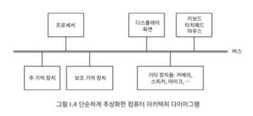

# 001 컴퓨터의 논리와 구조
## 컴퓨터 구성
- 논리적 구성 측면
  - 컴퓨터가 어떤 부분들로 이루어져 있고, 무슨 일을 하며 어떻게 연결되는 지
- 물리적 구조 측면
  - 각 부분이 어떻게 생겼고, 어떻게 만들어 지는 지

"장치별로 내부적인 근본 원리는 같음"

PC
- 개인용 컴퓨터(Personal Computer). 주로 'PC'라는 약칭으로 부른다.
- 넓은 의미로는 개인용 컴퓨터 전반을 지칭하는 일반 명사지만, 좁은 의미로는 IBM PC 호환기종을 의미하며, 더 좁은 의미로는 IBM이 생산 판매했던 컴퓨터 제품의 상품명

네트워크 효과
- 많은 사람들이 사용할 수록 효용이 커짐

# 002 프로세서 속도와 심장 박동수

기본 표준 구조
- 프로세서, 메모리, 저장장치, 입출력장치

폰노이만 아저씨
- 프로세서는 산술 연산과 제어 기능을 제공
- 주 기억 장치와 보조 기억 장치는 기억과 저장을 담당
- 키보드, 마우스, 디스플레이는 운영자와 상호작용을 함

> - 프로세서 == CPU
> - RAM == 주 기억 장치
> - 디스크나 드라이브 == 보조 기억 장치

## 프로세서
- 컴퓨터의 두뇌에 해당
- 산술 연산과, 데이터 이동, 다른 구성요소 작업 제어 역할

## 주 기억 장치
- 프로그램 내장식 컴퓨터
  - 프로세서가 현재 작업 중인 데이터뿐만 아니라, 명령어를 메모리에 적재하여 여러 명령어를 실행할 수 있다.
- 메모리에 저장된 위치와 무관하게 같은 속도로 접근이 가능하다.
- 용량이 한정적이고, 전원이 꺼지면 정보가 사라진다. (휘발성)

# 003 HDD와 SSD의 차이

## 보조 기억 장치
- 전원이 꺼져도 정보가 유지된다.
- 자기 디스크
  - 하드 디스크, 하드 드라이브, SSD(Solid State Drive)
- 데이터, 명령어, 다른 모든 정보는 보조기억장치에 장기간 저장되고, 주 기억 장치로는 일시적으로만 옮겨진다.
- 주 기억장치보다는 저렴하지만, 정보에 접근하는 속도는 더 느리다.
- 플래시 메모리
  - 비휘발성
  - 기존 디스크 저장 장치보다 더 빠르고 안정적이며, 고장이 덜나고, 전력을 더 적게 사용한다.
- 구조가 추상화 되어있다.

> 추상화
> - 사용자에게는 파일 시스템의 계층구조(논리적인 구성)로 노출되지만, 물리적인 구현의 세부사항은 숨겨져 있다. 

## 그 외 다른 장치들...
- 입력 장치: 마우스, 키보드, 터치 스크린, 마이크, 카메라, 스캐너
- 출력 장치: 디스플레이, 프린터, 스피커
- 네트워크 장치: 와이파이, 블루투스

단일 기기로 합쳐지고 있다... 스마트폰, 태블릿 PC...

# 004 가로세로 1cm 프로세서 칩
- 컴퓨터의 전자 회로는 몇가지 기본 소자가 매우 많이 모여 만들어진다.
- 가장 중요한 기본 소자로는 논리게이트를 들 수 있다.
- 논리게이트는 한개나 두개의 입력 값을 바탕으로 단일 출력값을 계산해낸다.

## 트랜지스터
- 회로소자에서 가장핵심적인 부분은 트랜지스터다.
- 트랜지스터는 기본적으로 스위치 역할을 한다.

## 논리게이트
- 논리게이트는 집적회로 상에서 만들어진다.

## 집적회로
- 집적회로에 수십억개의 트랜지스터가 존재한다. 
- 집적회로는 원형 웨이퍼상에서 한꺼번에 제조된다.

## 웨이퍼
- 실리콘으로 만든 기둥을 얇게 썬 판
- 웨이퍼라는 얇은 판에 다수의 동일 회로를 만들어 반도체 집적회로가 탄생된다. -> 피자를 만들 때 토핑을 올리기 전 도우를 만들 듯이,,
- 웨이퍼는 잘려서 각 칩으로 나뉘고, 칩은 하나씩 패키징 된다.
- https://www.samsungsemiconstory.com/kr/%eb%b0%98%eb%8f%84%ec%b2%b4-8%eb%8c%80-%ea%b3%b5%ec%a0%95-1%ed%83%84-%ec%9b%a8%ec%9d%b4%ed%8d%bc%eb%9e%80-%eb%ac%b4%ec%97%87%ec%9d%bc%ea%b9%8c%ec%9a%94/

집적회로가 실리콘 기반으로 만들어진다는 점에 착안해서 집적회로 사업이 처음으로 시작된 캘리포니아 샌프란시스코 남부지역에 실리콘 밸리라는 별명이 붙었다.
- 밸리: 미국 서부 캘리포니아 주 서부의 도시 샌타클래라의 샌타클래라 계곡에 연구 단지가 위치
  - 이 지역은 비가 많이 내리지 않아 습기가 적어 전자산업에 적절한 환경을 제공한다.
  - 명문 대학들도 이 근처에 있어 우수 인력 확보에 유리한 위치이다.

# 005 50년 넘게 유지된 무어의 법칙
기술이 향상됨에 따라 일정한 크기의 집적회로에 들어갈 수 있는 트랜지스터의 수가 매년 대략 두배가 된다고 관측했다.
- 디지털 혁명

# 006 요약
성능은 기하급수적으로 샹항되었지만, 논리적 기능적 속성은 변하지 않는다.

# 007 연속과 불연속
컴퓨터는 디지털 처리 장치다.
- 불연속적인 덩어리로 입력받고, 불연속적인 값을 갖는 정보를 저장하고 처리한다.
컴퓨터는 정보를 비트로 표현한다.
- 0, 1의 이진수로 표현한다.
비트는 모여서 더 큰 정보를 표현한다.
- 숫자, 문자, 단어, 등 비트가 모여 표현된다.

## 아날로그
- 자동차 아날로그 속도계, 온도계 

데이터가 전송되고 처리할때는 디지털 방식으로 -> 정보를 버리고 압축하는데 효과적

# 008 아날로그 정보를 디지털로 바꾸기
- 이미지 디지털화: 
  - 검출소자의 직사각형 배열
  - 검출 소자에 들어오는 빛의 양에 비례하는 양으로 전하를 저장
  - 배열은 적색, 녹색, 청색 빛의 양을 측정하는 세 개의 검출 소자로 구성
  - 각 요소는 화소라는 뜻에서 픽셀 이라고 함
- 음향 디지털화
  - 주파수를 수치로 변환: 디지털 표현
  - 압축
- 영화 디지털화
  - 영상과 음향을 결합
- 텍스트 디지털화
  - 아스키 코드
  - 유니코드
# 009 0과 1의 세계
- 비트(binary digit)
  - 이진 숫자, 0 또는 1
- 2의 거듭제곱과 10의 거듭제곱

# 010 비트 모아 데이터
- 이진수
  - 두가지 상태로 정의하는 것이 쉬워 이진수를 사용함
- 바이트

# 013 모형 컴퓨터로 더하기 프로그램 만들기
- 누산기
  - GET, PRINT, STORE M, LOAD M, ADD M, STOP
  - GOTO, IFZERO
- 프로세스
  - 인출, 해석, 실행
- 유사 명령어
- 메모리 내부 표현

# 014 프로세서는 무조건 빠른 게 좋을까?
- 폰 노이만 "일반적으로 산술 장치의 내부 자원 운영은 빠른 연산 속도에 대한 욕과와 기계의 단순성 도는 저비용에 대한 욕구 사이의 절충으로 결정된다."
- 프로세서는 인출, 해석, 실행 사이클을 반복 수행
- 실제 프로그램은 흔히 명령어 수백만 개로 이루어진다.
- 명령어 집합
  - 프로세서가 제공하는 명령어 레퍼토리
- 컴퓨터 아키텍처는 기능성, 속도, 복잡도, 전력 소모 정도, 프로그램 가능성 등 상충하는 요구 간 복잡한 trade off를 수반한다.
- 메모리는 프로레서보다 현저히 느려 캐시라는 고속 메모리를 사용한다.
- 파이프라이닝 
  - 명령어 여러개가 다양한 단계에 걸쳐 진행되도록 함
- 개별 프로세서는 더이상 빨라지지 않지만, 더 많은 코어를 쓸 수 있어서 실질적인 연산속도는 꾸준히 증가하고 있다.
- 프로세서
  - 데스크탑, 노트북: 인텔, AMD
  - 휴대전화, 태플릿 PC: ARM
- 프로세서 간 속도를 비교하는 것은 어렵고 요구사항에 따라 차이가 있기 때문에 의미가 없다.
