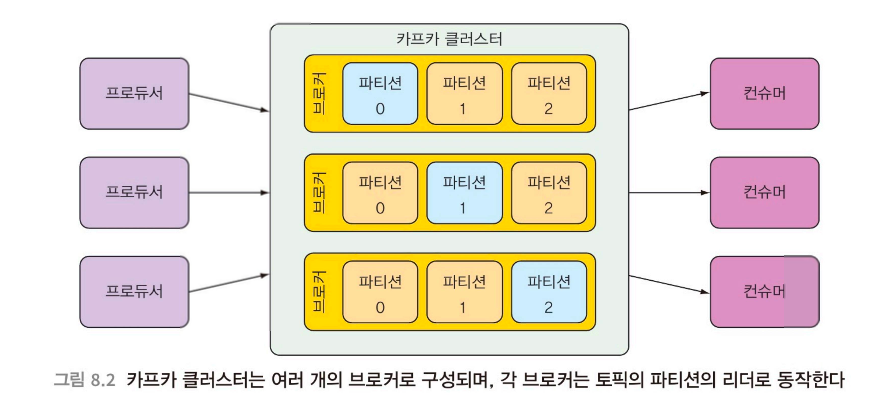

# 8장 비동기 메시지 전송하기

----
이 장에서 배우는 내용
- 비동기 메시지 전송
- JMS, RabbitMQ, 카프카(Kafka)를 사용해서 메시지 전송하기
- 브로커에서 메시지 가져오기
- 메시지 리스닝하기
- ----

## asynchronous
- 어플리케이션 간에 응답을 기다리지 않고 간접적으로 메시지를 전송하는 방법
  - 어플리케이션 간 비동기 메시지 큐를 이용한 통신 방식은 간접 계층을 제공
    - **결합도를 낯주고 확장성을 높여준다**

## 풀 모델, 푸시 모델
- 푸시 모델? 메시지가 수신 가능하게 되면 코드로 자동 전달하는 모델
- 풀 모델? 코드에서 메시지를 요청하고 도착할 때까지 기다리는 모델

## 메시지 리스너
메시지가 도착할 때까지 대기하는 수동적 컴포넌트
- 요청에 비해 처리가 느릴 때는 메시지 리스너를 사용하기 보다, 풀 모델이 적합하다. 병목현상 발생 가능

## Kafka 사용하기
- 메시징 시스템
- 높은 확장성 제공
- 토픽을 파티션으로 분할하여 메시지 관리
- 
  - 토픽은 클러스터의 모든 브로커에 걸쳐 복제된다.
  - 클러스터의 각 노드는 하나 이상의 토픽에 대한 리더로 동작하며 토픽 데이터를 관리하고 클러스터의 다른 노드로 데이터를 복제한다.
  - 각 토픽은 여러개의 파티션으로 분할될 수 있다.
    - 클러스터의 각 노드는 한 토픽의 하나 이상의 파티션의 리더가 된다.

### @KafkaListener 사용
메세지 리스너 애노테이션을 빈 메서드에 지정하면 푸시 모델의 형태로 컨슈머에게 메시지가 전송될 수 있다.
- 언제든 메시지가 수신 가능할 때 자동 호출되는 메시지 리스너를 정의 후 애노테이션으로 해당 메소드를 지정


```java
@Component
public class OrderListener {
    
    @KafkaListener(topics="topic") 
    public void handle(Order order) {
        ui.displayOrder(order); 
    }
}
```


