# 리액터 개요

----
이 장에서 배우는 내용
- 리액티브 프로그래밍 이해하기
- 프로젝트 리액터
- 리액티브 데이터 오퍼레이션
----

명령형
- 순차적으로 연속되는 작업
- 각 작업은 한 번에 하나씩 그리고 이전 작업 다음에 실행된다.
- 데이터는 모아서 처리되고, 이전 작업이 데이터 처리를 끝낸 후에 다음 작업으로 넘어갈 수 있다.

리액티브
- 데이터 처리를 위한 일련의 작업들이 병렬로 실행된다.
- 각 작업은 부분 집합의 데이터를 처리할 수 있다.
- 처리가 끝난 데이터를 다음 작업에 넘겨주고 다른 부분 집합의 데이터로 계속 작업할 수 있다.

리액터
- 스프링 프로젝트의 일부분인 리액티브 프로그래밍 라이브러리다.
- 스프링5에서 리액티브 프로그래밍을 지원하는 데 필요한 기반이다.

명령형 프로그래밍의 한계
- 한 번에 하나씩 순서대로 실행하며 하나의 작업이 완전히 끝나기를 기다렸다가 그 다음 작업을 수행한다.
- 작업이 수행되는 동안 작업이 완료될 때까지 아무것도 할 수 없다. 스레드 차단

리액티브 프로그래밍
- 사용가능한 데이터가 있을 때마다 처리된다.

리액티브 스트림
- 차단되지 않는 백프레셔를 갖는 비동기 스트림 처리의 표준을 제공하는 것이 목적이다.
- 백프레셔를 사용하여 데이터 전달 폭주를 막는다.

리액티브 스트림 인터페이스
- Publisher (발행자)
  - 하나의 Subscription당 하나의 Subscriber에게 발행하는 데이터를 생성한다.
  - Subscriber가 구독 신청할 수 있는 subscribe() 메서드 한 개가 선언되어 있다.
  - ```java
    public interface Publisher<T> {
        void subscribe(Subscriber<? super T> subscriber);
    }
    ```
- Subscriber (구독자)
  - Publisher로 부터 이벤트를 수신한다.
  - onSubscribe()로 첫번째 이벤트를 수신하고 인자로 Subscription 객체를 Subscriber에 전달한다.
  - onNext(): Publisher가 전송하는 데이터가 Subscriber에게 전달된다.
  - onError(): 에러 발생 시 호출된다.
  - onComplete(): 작업이 끝났다고 Subscriber에게 알려준다.
  - ```java
    public interface Subscriber<T> {
        void onSubscribe(Subscription sub);
        void onNext(T item);
        void onError(Throwable ex);
        void onComplete();
    } 
    ```
- Subscription (구독)
  - request(): 전송되는 데이터를 요청
    - long n: 처리할 양 만큼 인자로 넘겨준다 (백프레셔)
  - cancel(): 더이상 데이터를 수신하지 않고 구독 취소
  - ```java
    public interface Subscription {
        void request(long n);
        void cancel();
    }
    ```
- Processor (프로세서)
  - 데이터를 수신하고 처리한다.
    - Subscriber 인터페이스와 Publisher를 결합한 것이다.
  - ```java
    public interface Processor<T, R> extends Subscriber<T>, Publisher<R> {}
    ```

리액티브 타입
- Mono
- Flux 

Mono와 Flux의 차이점

## 오퍼레이션
### 생성
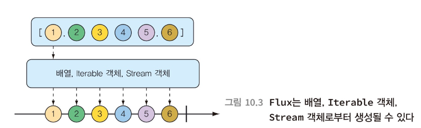
  - just()로 객체 생성
  - subscribe()로 구독자 추가
  - fromArray()로 배열로부터 생성
  - fromIterable()로 컬렉션으로부터 생성 
  - fromStream()으로 Stream 객체 생성
  - interval()을 이용해여 Flux 주기적으로 생성
    - 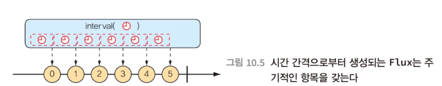
### 조합
  - mergeWith()로 방출된 순서대로 Flux 결합
    - 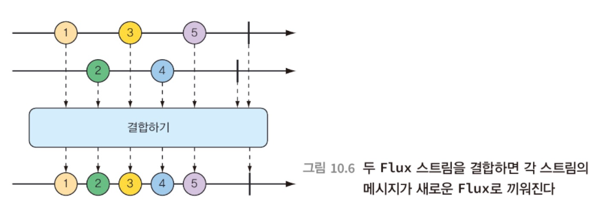
  - zip()으로 다른타입으로 결합
    - 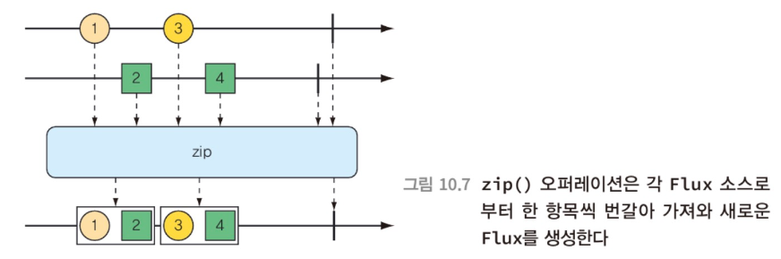
    - 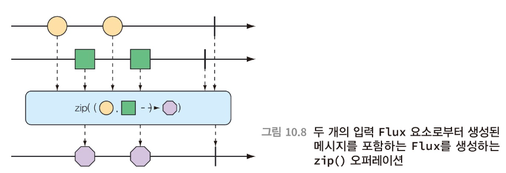
  - first() 느린값은 무시하고 빠른 값만 발행 
    - 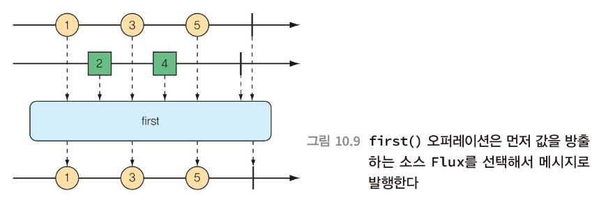
### 변환
  - skip() 지정된 수의 메시지를 건너뛴 후에 나머지 방출
    - 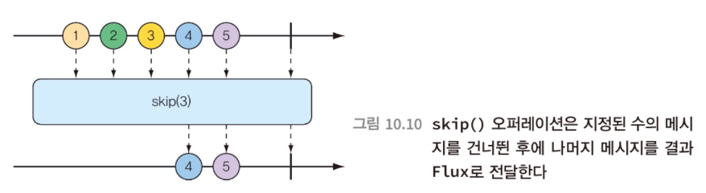
    - 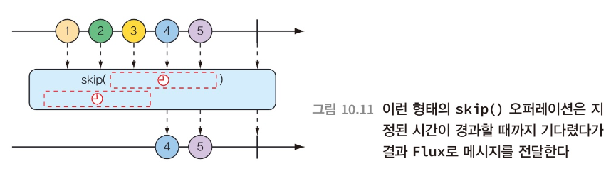
  - take() 처음부터 지정된 수/시간의 메시지만 방출
    - 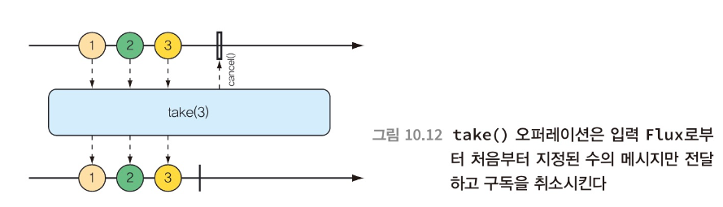
    - 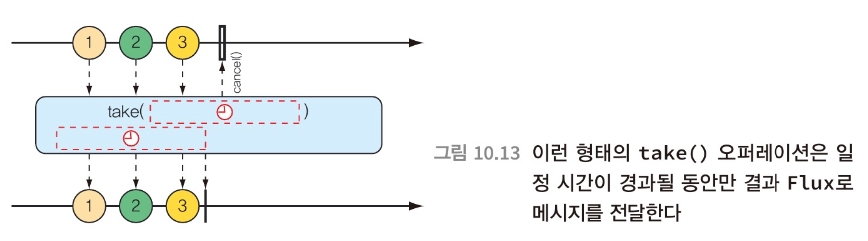
  - filter() 조건식에 일치되는 메시지만 방출
    - 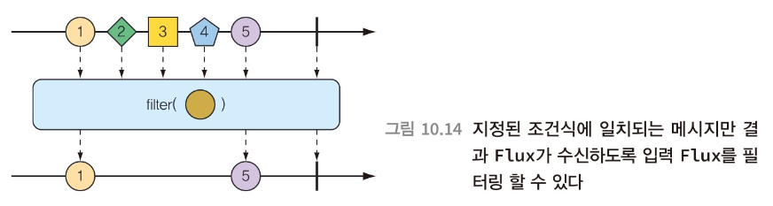
  - distinct() 발행된 적이 없는 메시지만 방출
    - 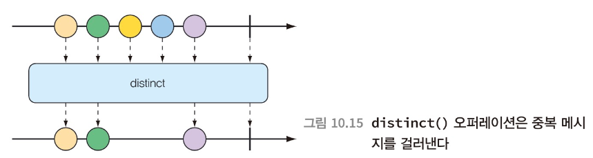
### 로직
### 매핑
  - map() 동기적으로 매핑이 수행
    - 한 객체를 다른객체로 매핑
    - 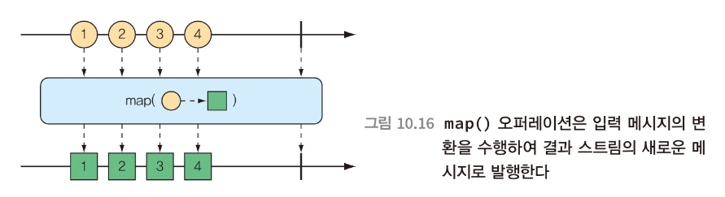
  - flatMap() 비동기적으로 매핑이 수행
    - 각 객체를 새로운 Mono나 Flux로 매핑하여 결과들이 하나의 새로운 Flux가 됨
    - subscribeOn()과 함께 사용하면 리액트 타입의 변환을 비동기적으로 수행
    - 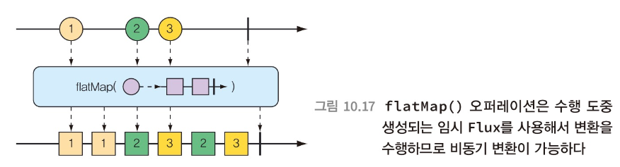

Schedulers
- immediate(): 현재 스레드에서 구독을 실행
- single(): 재사용이 가능한 스레드에서 구독을 실행 
- newSingle(): 매 호출마다 전용 스레드에서 구독을 실행
- elastic(): 무한하고 신축성 있는 풀에서 가져온 작업 스레드에서 구독을 실행
  - 필요시 세로운 작업 스레드가 생성되며 유휴 스레드는 제거됨
- parallel(): 고정된 크기의 풀에서 가져온 작업 스레드에서 구독을 실행, CPU 코어의 개수가 크기가 됨


flatMap() subscribeOn()을 사용할 때 장점
- 다수의 병행 스레드에 작업을 분할하여 스트림의 처리량을 증가시킴
- 그러나, 작업이 병행으로 수행되므로 어떤 작업이 먼저 끝날 지 보장이 안됨
  -> StepVerifier가 검사할 수 있음

### 데이터 버퍼링
- buffer(): 데이터 스트림을 작은 덩어리로 분할, List로 모음 
  - 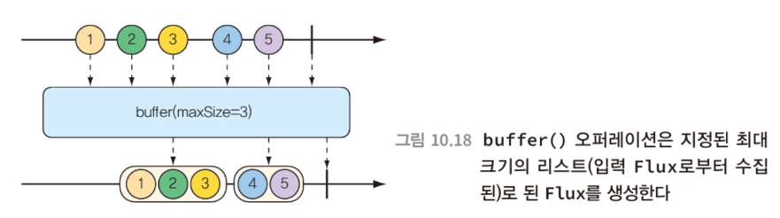
- collectList(): 모든 메세지를 갖는 List의 Mono 생성
  - 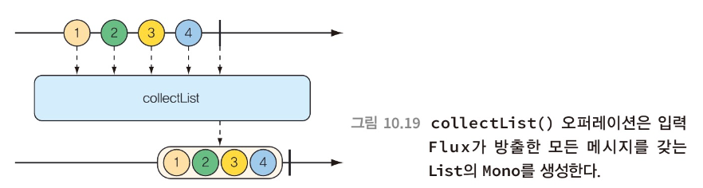
- collectMap(): Map을 포함하는 Mono를 생성
  - 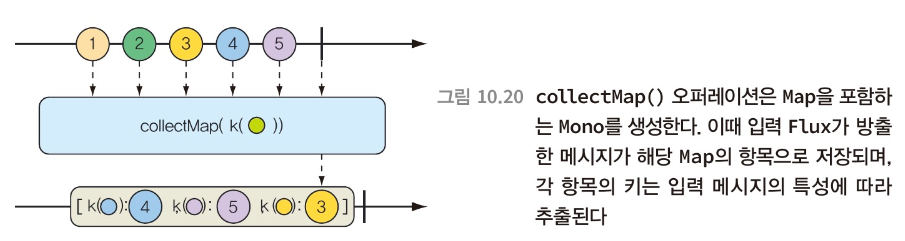


### 검증
StepVerifier
- all()
  - 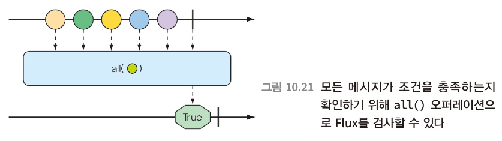
- any()
  - 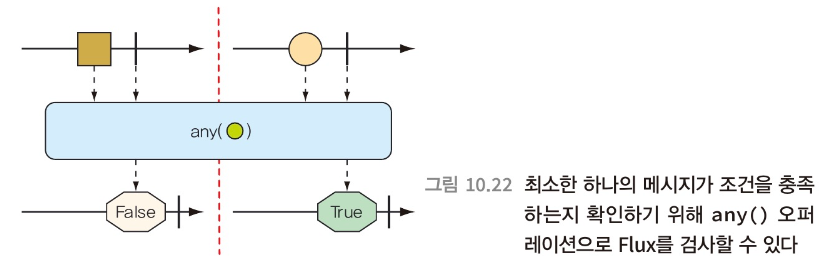

```gradle
implementation 'org.springframework.boot:spring-boot-starter-data-redis-reactive'
testImplementation 'io.projectreactor:reactor-test:3.1.0.RELEASE'
```
```groovy
@Unroll
def "mono 테스트"() {
    when:
    WebClient webTestClient = WebClient.builder().build()

    def get = webTestClient.get()

    def body = get
            .uri({ uriBuilder ->
                uriBuilder.scheme('http')
                        .host('localhost')
                        .port(port)
                        .path(UriConstant.API_BASE_PATH_V2 + '/goods/similar')
                        .queryParam('goodsNo', goodsNo + '')
                        .queryParam('size', size + '')
                        .build()
            })
            .header(HttpHeaders.CONTENT_TYPE, "application/json")
            .header(HeaderConstant.CALLER_KEY, HeaderConstant.CALLER_VALUE_SEARCH)
            .header(HeaderConstant.USER_IP_KEY, HeaderConstant.USER_IP_VALUE_SWAGGER)
            .retrieve()
            .<Map<String, Map>> bodyToMono(Map.class)

    then:
    StepVerifier.create(body)
            .expectNextMatches({ map ->
                return map.get('data').get('totalCount') > 0
            }).verifyComplete()

    where:
    goodsNo | size
    705441  | 5

}
```
