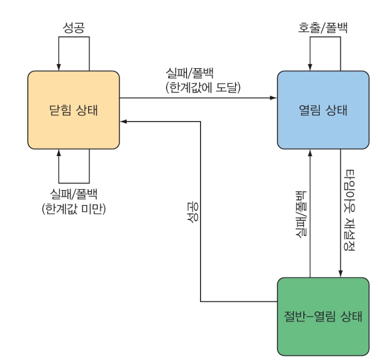
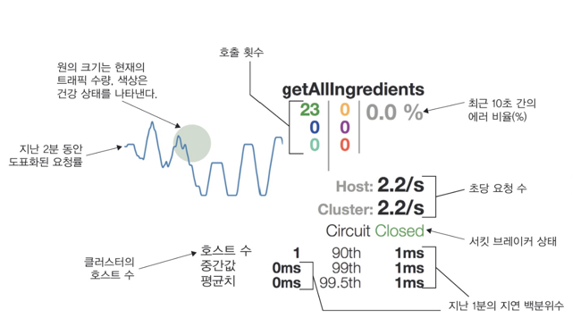
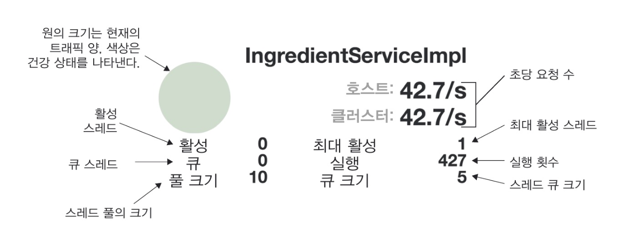

# 실패와 지연 처리하기 
512~536
----
- 서킷 브레이커 패턴 개요
- Hystrix로 실패와 지연 처리하기
- 서킷 브레이커 모니터링
- 서킷 브레이커 메트릭 종합하기
----

## 서킷 브레이커 이해하기
### 서킷 브레이커 패턴
- 우리가 작성한 코드가실행에 실패하는 경우에 안전하게 처리되도록 해준다.
- MSA에서 다른 서비스의 연쇄적인 실패로 확산되는 것을 방지하게 해줌
- 전기 회로 차단기와 유사
  - 스위치가 닫힘 위치에 있으면 회로를 통해 전기가 집에 흐르면서 전구, 텔레비전, 컴퓨터 등에 전원이 공급
  - 회선 장애 발생 시, 회로 차단기가 개방되어 전기 흐름을 차단
- 서킷은 닫힘 상태 -> 메서드 실행이 실패 -> 서킷 브레이커 개방 -> fallback으로 실패를 처리
  - 
    - 서킷이 절반-열림 상태로 바뀌면서 실패했던 메서드의 호출을 서킷 브레이커가 다시 시도
      - 성공하면 닫힘 상태로 변경된다.
- try/catch와 비슷하지만, 메서드가 너무 자주 실패하면 폴백 메서드를 호출한다

### 서킷 브레이커 선언 후보
- REST를 호출하는 메서드
  - 사용할 수 없거나, HTTP 500 응답을 반환하는 원격 서비스로 인해 실패할 수 있는 메서드
- 데이터베이스 쿼리를 수행하는 메서드
  - 어떤 이유로든 데이터베이스가 무반응 상태가 되거나, 어플리케이션을 중단시킬 수 있는 스키마의 변경이 생기면 실패할 수 있음
- 느리게 실행될 가능성이 있는 메서드
  - 이것은 반드시 실패하는 메서드는 아니지만, 너무 오랫동안 실행된다면 비정상적인 상태를 고려할 수 있음

-> 서킷 브레이커 패턴은 코드의 실패와 지연을 처리하는 강력한 수단이다.
-> Netfilx 오픈 소스 프로젝트의 Hystrix 라이브러리를 사용하여 적용 가능

### Netfilx Hystrix
- 서킷 브레이커 패턴을 자바로 구현한 라이브러리
- 대상 메서드가 실패할 때 폴백 메서드를 호출하는 어스펙트로 구현된다.

## 서킷브레이커 선언하기
- 의존성 추가
- 활성화
  - @EnableHystrix

### 지연시간 줄이기
- 타임아웃 설정
  - @HystrixProperty
    - name=execution.isolation.thread.timeoutInMilliseconds, value=500
    - name=execution.timeout.enabled, value=false
- 한계값 설정
  - circuitBreaker.requestVolumeThreshold
    - 지정된 시간 내에 메서드가 호출되어야 하는 횟수
  - circuitBreaker.errorThresholdPercentage
    - 지정된 시간 내에 실패한 메서드 호출의 비율(%)
  - metrics.rollingStats.timeInMilliseconds
    - 요청 횟수와 에러 비율이 고려되는 시간
  - circuitBreaker.sleepWindowInMilliseconds
    - 절반-열림 상태로 진입하여 실패한 메서드가 다시 시도되기 전에 열림 상태의 서킷이 유지되는 시간

## 실패 모니터링 하기
### Hystrix Stream
- 서킷 브레이커로 보호되는 메서드가 매번 호출될 때마다 해당 호출에 관한 여러 데이터가 수집되어 Hystrix 스트림으로 발행된다.
  - 어플리케이션 health를 실시간으로 모니터링
    - 메서드가 몇 번 호출되는지
    - 성공적으로 몇 번 호출되는지
    - 폴백 메서드가 몇 번 호출되는지
    - 메서드가 몇 번 타임아웃 되는지
- actuator 엔드포인트로 제공됨
  - /actuator/hystrix.stream 경로로 노출되어 있음
  - management.endpoint.web.exposure.include: hystrix.stream 설정으로 활성화

### Hystrix 대시보드
- spring-cloud-starter-netflix-hystrix-dashboard 의존성 추가
- @EnableHystrixDashboard 애노테이션으로 대시보드 활성화
- 고유한 포트 설정
- 

### Hystrix 스레드 풀 이해하기

- 활성 스레드 카운트
- 큐 스레드 카운트
- 풀 크기
- 최대 활성 스레드 카운트
- 실행 횟수
- 큐 크기

## 다수의 Hystrix 스트림 종합하기
Turbine 으로 여러개의 스트림을 모니터링 할 수 있다.

