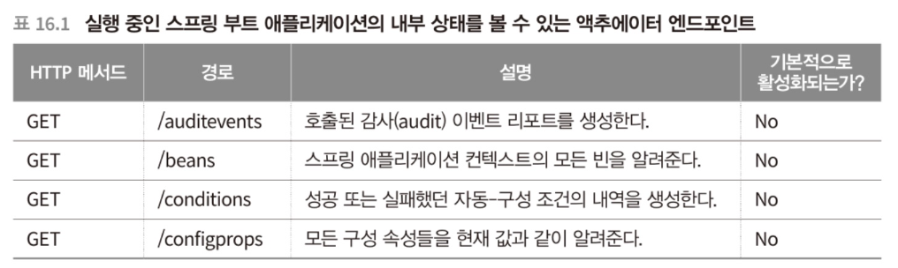
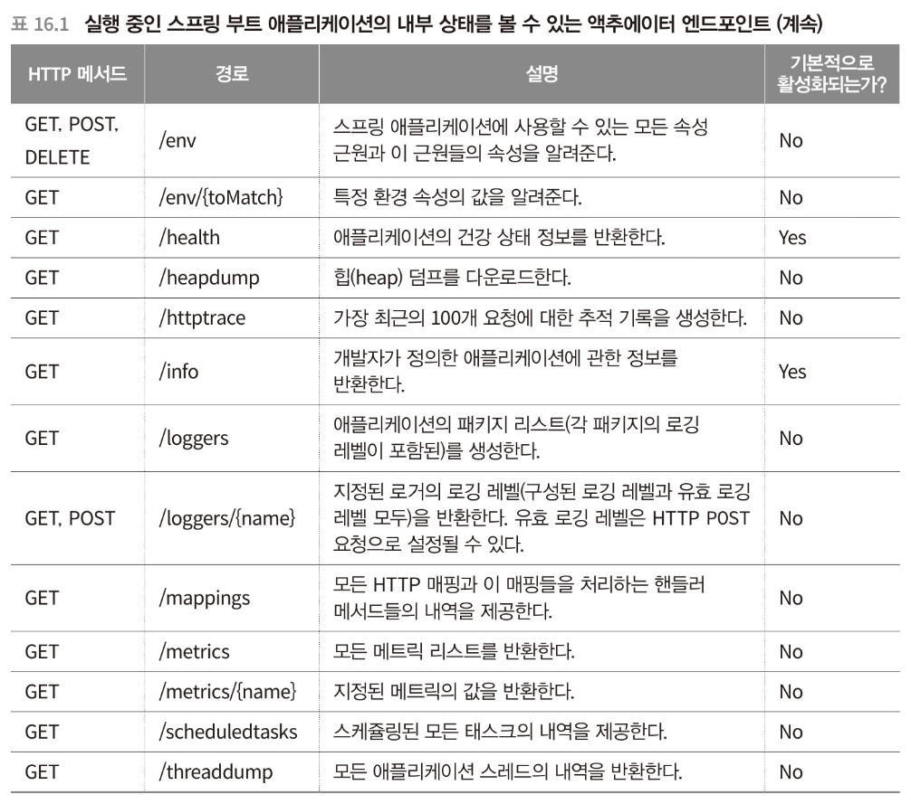

# 스프링 부트 액추에이터 사용하기

----
이 장에서 배우는 내용
- 스프링 부트 프로젝트 에추에이터 활성화하기
- 액추에이터 엔드포인트 살펴보기
- 액추에이터 커스터마이징
- 액추에이터 보안 처리하기
----

## 액추에이터 개요
액추에이터
- 실행중인 스프링 애플리케이션 내부를 살펴볼 수 있다.
  - 애플리케이션 환경에서 사용할 수 있는 구성 속성들
  - 애플리케이션에 포함된 다양한 패키지의 로깅 레벨
  - 애플리케이션이 사용 중인 메모리
  - 지정된 엔드포인트가 받은 요청 횟수
  - 애플리케이션의 건강 상태 정보




- 액추에이터 기본 경로는 /actuator
- 변경하고 싶다면, management.endpoint.web.base-path 값 설정

```yml
management:
  endpoints:
    web:
      base-path: /management
      exposure:
        include: health,env,caches,metrics,hystrix.stream,prometheus
      path-mapping:
        health: healthcheck
```

## 액추에이터 엔드포인트 소비하기
기본 경로 GET요청을 하면 HATEOAS(헤이티오스) 링크를 응답으로 받을 수 있다.
- Hypermedia As The Engine of Application State
  ```json
  {
    "_links": {
        "self": {
        "href": "http://localhost:8000/search/monitor",
        "templated": false
      },
      "caches-cache": {
        "href": "http://localhost:8000/search/monitor/caches/{cache}",
        "templated": true
      },
      "caches": {
        "href": "http://localhost:8000/search/monitor/caches",
        "templated": false
      },
      "health": {
        "href": "http://localhost:8000/search/monitor/healthcheck",
        "templated": false
      },
      "health-path": {
        "href": "http://localhost:8000/search/monitor/healthcheck/{*path}",
        "templated": true
      },
      "env": {
        "href": "http://localhost:8000/search/monitor/env",
        "templated": false
      },
      "env-toMatch": {
        "href": "http://localhost:8000/search/monitor/env/{toMatch}",
        "templated": true
      },
      "prometheus": {
        "href": "http://localhost:8000/search/monitor/prometheus",
        "templated": false
      },
      "metrics": {
        "href": "http://localhost:8000/search/monitor/metrics",
        "templated": false
      },
      "metrics-requiredMetricName": {
        "href": "http://localhost:8000/search/monitor/metrics/{requiredMetricName}",
        "templated": true
      }
    }
  }
  ```

### /info
- 애플리케이션 정보
- yml에 설정한 값에 대해 보여준다.

### /health
- 애플리케이션의 health 정보
- status
  - UP: 외부 시스템이 작동중이고 접근 가능하다.
    - health 지표 모두 UP이어야 `status: UP`
  - DOWN: 외부 시스템이 작동하지 않거나 접근할 수 없다. 
    - health 지표 중 하나라도 DOWN이면 `status: DOWN`
  - UNKNOWN: 외부 시스템의 상태가 분명하지 않다. 
  - OUT_OF_SERVICE: 외부 시스템에 접근할 수 있지만, 현재는 사용할 수 없다.
    - health 지표 중 하나라도 OUT_OF_SERVICE이면 `status: OUT_OF_SERVICE`
- health 지표를 자세하게 볼 때, 
    ```yml
    management:
      endpoint:
        health:
          show-details: always
      health:
        defaults:
          enabled: false # DB 상관 없이, 인스턴스 상태만 확인할 때  
    ```

### /beans
- 최상위 요소는 컨텍스트이고, 컨텍스트 내 모든 빈의 상세정보를 보여준다.

### /conditions
- auto-configure 구성 내용을 보여준다.
- positiveMatches, negativeMatches, unconditionalClasses

### /env
- 사용 가능한 환경 속성들을 보여준다.
- activeProfiles, propertySources
- POST로 속성 설정이 가능하다.
  - 일시적 적용, 애플리케이션 재시작 시 설정은 사라진다.

### /mappings
- HTTP 요청 - 매핑 내용을 보여준다.

### /loggers
- 로깅 레벨 설정 값을 보여준다.
  - 전체 로깅 레벨과 패키지 별 로깅 레벨을 보여줌

### /httptrace
- 애플리케이션이 처리한 가장 최근의 100개 요청을 보여준다.
- 요청 메서드, 경로, 타임스탬프, 헤더, 소요 시간 등

### /threaddump
- 실행중인 애플리케이션의 스레드 모니터링

### /metrics
- 실팽중인 애플리케이션의 온갖 종류의 메트릭을 제공한다.
- 메모리, 프로세스, 가비지 컬렉션, HTTP요청 관련 메트릭 등
- measurement 하위의 값이 주요 지표 
  - tag로 status 값을 필터링하여 볼 수 있음


