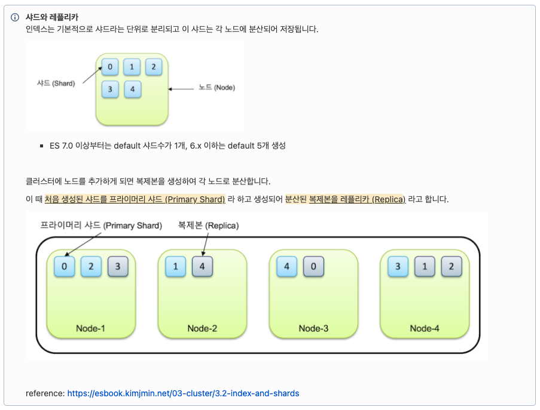
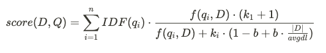

## Elasticsearch 기본 개념 정리
### Elasticsearch 실행 옵션

-**d** : 백그라운드 데몬으로 실행한다.

```bash
$ bin/elasticsearch -d
```

**-p <파일명>** : ES 프로세스 ID를 지정한 파일에 저장한다. ES가 종료되면 파일이 자동으로 삭제된다.

```bash
$ bin/elasticsearch -d -p es.pid
$ cat es.pid
```

### Elasticsearch 환경 설정

jvm.options - Java 힙메모리 및 환경변수

```bash
-Xms1g
-Xmx1g
```

elasticsearch.yml - Elasticsearch 옵션

```yaml
http.port: <포트번호>    # ES-Client 사이의 통신을 위한 http port 설정
transport.port: <포트번호>    # ES 노드 사이의 통신을 위한 tcp port 설정
discovery.see_hosts: ["", ""]    # 클러스터 구성을 위한 노드 IP 배열, 디스커버리 과정
cluster.initial_master_nodes: ["", ""]    # 명시된 노드 중 마스터 노드 선출
```

### 클러스터 구성
- 물리적인 구성과 상관 없이 여러 노드가 하나의 클러스터로 묶이기 위해서는 클러스터명 [cluster.name](http://cluster.name/) 설정이 묶여질 노드들 모두 동일해야 한다.
- Discovery: discovery.seed_hosts안에 포함된 노드를 찾아 하나의 클러스터로 바인딩 하는 과정이다.

```
Discovery flow

1. 노드 존재 여부 확인
2. cluster.name 확인
3. 반복
4. 끝나면 새로운 클러스터 시작
```
### 인덱스와 샤드
- 클러스터 당 최소 3개의 노드로 구성 권장한다. 
- 프라이머리 샤드와 리플리카를 통해 노드가 유실 되어도 데이터의 가용성과 무결성을 보장한다. 
- 프라이머리 샤드 수는 인덱스를 처음 생성할 때 지정하며, 인덱스를 재색인 하지 않는 이상 바꿀 수 없다.

### 노드의 역할
ES 클러스터는 서로 다른 역할을 하는 노드로 구성
- `node.master: true`
    - 인덱스의 메타 데이터, 샤드의 위치와 같은 클러스터 상태 정보를 관리
    - 모든 클러스터는 1개의 마스터 노드 존재
    - 마스터 노드가 다운되거나 연결이 끊어진 경우, 남은 마스터 후보 노드(node.master: true인 노드)들 중에서 새로운 마스터 노드 선출
- `node.data: true`
    - 실제 색인된 데이터를 저장하고 있는 노드
- `node.ingest: true`
    - 데이터 색인 전 전처리 작업을 수행할수 있는지에 대한 여부
- `node.ml: true`
    - 머신러닝 작업을 수행할수 있는지에 대한 여부
    
### Split Brain
- 마스터 후보 노드 개수는 항상 홀수로 한다.
- 가동을 위한 최소 마스터 후보 노드 설정은 **(전체 마스터 후보 노드) / 2 + 1** 로 설정해야 한다.


### 샤드와 레플리카

- 샤드와 레플리카의 개수 설정은 인덱스 생성 시 settings에서 설정이 가능하다.

### BM25


### Bool Query
- **must** : 쿼리가 참인 도큐먼트들을 검색합니다.
- **must_not** : 쿼리가 거짓인 도큐먼트들을 검색합니다.
- **should** : 검색 결과 중 이 쿼리에 해당하는 도큐먼트의 점수를 높입니다.
- **filter** : 쿼리가 참인 도큐먼트를 검색하지만 스코어를 계산하지 않습니다. must 보다 검색 속도가 빠르고 캐싱이 가능합니다.
