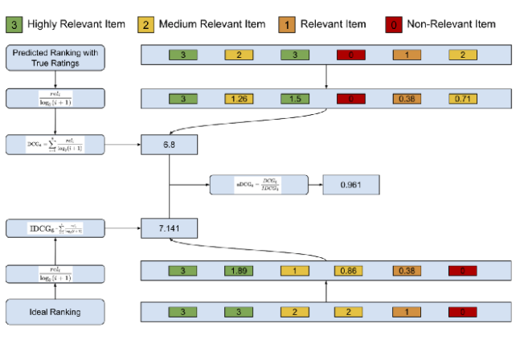

# 정렬 순서를 고려한 검색 모델 평가 지표
## MRR: Mean Reciprocal Rank
- 우선순위를 고려한 평가기준 중 가장 간단한 모델.
- 각 사용자마다 클릭한 상품 중 가장 상위의 위치를 역수로 계산하고, 사용자별로 계산된 점수를 모아 평균을 내는 방법.
- 가장 단순하고 계산이 쉬운 지표지만 상위 케이스에 대해서만 계산함으로 정교함이 떨어진다.

## mAP: mean Average Precision
- 우선순위를 고려한 성능을 평가할 수 있다.
- 상위에 있는 오류에 대해서는 가중치를 더주고, 하위에 있는 오류에 대해서는 가중치를 적게 주어 관련 컨텐츠가 상위에 오를 수 있도록 도움을 준다.
- 관련 여부가 명확하지 않은 경우에 계산하기 어렵다.
- 평점같은 관련 여부를 판단하기 어려운 경우는 사용하기 어렵다.

## nDCG: normalized Discounted Cumulative Gain
- mAP처럼 이분법적으로 구분하는게 아닌, 더 관련있는 컨텐츠는 무엇인가에 대해 집중하여 더 관련있는 컨텐츠를 덜 관련있는 컨텐츠보다 상위에 노출시키는지 평가한다.
- 도출 과정
  1. 모든 컨텐츠들의 관련도를 합하여 CG(Cumulative Gain)을 구한다.
  2. CG에서 추천 컨텐츠들의 관련도를 합하였다면, DCG는 각 추천 컨텐츠의 관련도를 log함수로 나누어 값을 구한다.
     1. log함수 특성상 위치값이 클수록(하위에 있을수록) DCG의 값을 더 작아지게 함으로써 상위 컨텐츠의 값을 점수에 더 반영할 수 있게 한다.
  3. DCG 값에 관련도를 더 강조하고 싶다면, `2^관련도-1`과 같이 관련도의 영향을 증가시킬 수 있다.
  4. 사용자마다 제공되는 추천 컨텐츠의 DCG와는 별개로 IDCG(이상적인 DCG)를 미리 계싼해놓는다.
  5. 각 사용자의 DCG를 IDCG로 나누어서 사용자별 NDCG를 구한다.
  6. 사용자별 NDCG의 평균을 구하여 해당 IR의 NDCG를 구한다.
- 기존방법과는 다르게 다양한 관련도에 대해 평가가 가능하다.
- 이분법적인 관련도에도 뛰어난 성능을 보인다.
- 사용자의 관련 컨텐츠가 없다고 판단될 경우, 임의로 nDCG를 0으로 설정해주어야 한다.

## Summary
- 사용자가 잘 알만한 컨텐츠를 추천하고, 추천하는 첫번째 관련 컨텐츠가 중요하다면 MRR
- 추천 컨텐츠의 관련도를 이분법으로 판단할 수 있고, 추천 컨텐츠의 노출 위치가 중요하다면 MAP
- 추천 컨텐츠의 관련도를 여러가지 값으로 표현할 수 있고, 관련도에 따른 가중치 조정을 하고싶다면 nDCG

----
reference: 
- https://lamttic.github.io/2020/03/20/01.html
- https://medium.com/swlh/rank-aware-recsys-evaluation-metrics-5191bba16832