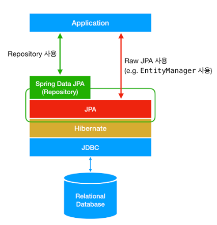

# JPA, Hibernate, Spring Data JPA의 차이점
## JPA
- Java Persistence API 
- 자바 어플리케이션에서 관계형 데이터베이스를 사용하는 방식을 정의한 인터페이스 
- 말 그대로 인터페이스다!! 특정 기능을 하는 라이브러리가 아니다. (RDB를 어떻게 사용해야 하는지를 정의한 방법일뿐)

JPA는 단순히 명세이기 때문에, JPA를 정의한 패키지 대부분은 interface, enum, Exception, 그리고 각종 Annotation으로 이루어져 있음 
- 예를 들어, JPA의 핵심이 되는 EntityManager는 javax.persistence.EntityManager라는 파일에 interface로 정의되어 있음

## Hibernate는 JPA의 구현체이다.

- javax.persistence.EntityManager와 같은 인터페이스를 직접 구현한 라이브러리

## Spring Data JPA는 JPA를 쓰기 편하게 만들어 놓은 모듈이다.

- Spring Data JPA의 핵심은Repository 
- Repository 인터페이스에 정해진 규칙대로 메서드를 입력하면 알아서 해당 메서드 이름에 적합한 쿼리를 날리는 구현체를 만들어 Bean으로 등록해줌

혼동하지 말자!

