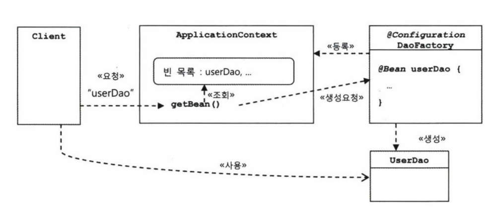

# 1주차 (p52 ~ p83)
## DAO (Data Access Object)
- DB를 사용해 데이터를 조회하거나 조작하는 기능을 전담하도록 만든 오브젝트
- DB에 접근을 하기 위한 로직과 비지니스 로직을 분리하기 위해 사용
- DB와 연결할 Connection 까지 설정되어 있는 경우가 많음
  - _그러나, MyBatis 등을 사용할 경우 커넥션 풀까지 제공 해주기 때문에 DAO를 별도로 만드는 일이 드물다._

## 자바빈 (JavaBean)
- 기존 의미: 비주얼 툴에서 조작 가능한 컴포넌트
- 요즘엔? 아래 두 가지 관례를 따라 만들어진 오브젝트를 말함!
  - 자바빈은 파라미터가 없는 디폴트 생성자를 갖고 있어야 한다.
    - _툴이나 프레임워크에서 `리플렉션`을 이용해 클래스의 정보를 얻어 오브젝트를 생성하기 때문!_
    > 리플렉션(Reflection)이 뭔뎅?
    > - 자바에서 제공하는 기술 중 하나
    > - 실행중인 자바 프로그램이 프로그램 자신의 정보를 알아낼 수 있고, 프로그램 자신의 속성(프로퍼티)을 조작할 수 있게 함
  - 자바빈이 노출하는 이름을 가진 속성을 프로퍼티라고 하는데, 프로퍼티는 `setter`와 `getter`를 이용해 수정 또는 조회할 수 있다. 


**"스프링은 단지 우리가 고민을 제대로 하고 있는지 끊임없이 확인해주고, 좋은 결론을 내릴 수 있도록 힌트를 제공해줄 뿐!"**


## 개발자가 객체를 설계 할 때 염두에 둬야 할 사항
- 미래의 변화를 어떻게 대비할 것인가
  - 어떻게?: 가장 좋은 대책은 변화의 폭을 최소한으로 줄여주는 것 -> **_분리와 확장을 고려한 설계를 하자!_**

### 분리
관심사를 분리하고 중복 메소드를 추출하자

#### 리팩토링
- 기존의 코드를 외부의 동작방식에는 변화 없이, 내부 구조를 변경해서 재구성하는 작업 또는 기술
- 코드를 이해하기 편해지고 변화에 효율적으로 대응할 수 있다.
- 생산성이 올라가며 코드의 품질이 높아지고 유지보수에 용이해지며 견고하면서도 유연한 제품을 개발할 수 있다. (좋은거 다 써놓음👍🏻)

### 상속을 통한 확장
서브 클래스에서 상황에 맞게 구현해 사용하자

#### 템플릿 메소드 패턴
슈퍼 클래스에 기본적인 로직의 흐름을 만들고 그 기능의 일부를 추상 메소드나 오버라이딩이 가능한 protected 메소드 등으로 만든 뒤 서브 클래스에서 이런 메소드를 필요에 맞게 구현해 사용하도록하는 방법
- 변하지 않는 기능은 슈퍼클래스에, 자주 변경되며 확장할 기능은 서브클래스에

#### 팩토리 메소드 패턴
서브 클래스에서 구체적인 오브젝트 생성 방법을 결정하게 하는 방법


> ### 디자인 패턴
> 소프트웨어 설계 시 특정 상황에서 자주 만나는 문제를 해결하기 위해 사용할 수 있는 재사용 가능한 솔루션
> - 주로 객체지향 설계에 관한 것이고 객체지향 설계 원칙을 이용해 문제를 해결
> - 클래스 상속, 오브젝트 합성 두 가지 구조로 대부분 정리된다.
> - _**가장 중요한 것은 패턴의 핵심이 담긴 목적 또는 의도이다.**_


### 상속의 단점
- 다중상속을 허용하지 않는다.
- 상속을 통한 상하위 클래스의 관계는 생각보다 밀접하다.
- 클래스를 분리하여 관계를 끊어보자!


### 클래스를 분리하였을 때 단점
- 확장이 어려워진다. (클래스명, 메소드 등 많은 정보를 알고 있어야 한다.)
- 인터페이스를 사용하자!

### 인터페이스
- 어떤 일을 하겠다는 기능만 정의해놓은 것, 구체적인 구현 방법은 나타나있지 않음
  - 인터페이스를 사용하는 쪽은 그 기능을 어떻게 구현했는지에 대해 관심 둘 필요가 없음
- 인터페이스는 자신을 구현한 클래스에 대한 구체적인 정보는 모두 감춰버린다.
  - 구현 클래스를 바꿔도 신경 쓸 일이 없음

> ### default method 등장
> java 8 이후, 인터페이스 내부에도 로직이 포함된 메소드를 선언할 수 있게 되었다.
> - 추가적으로 구현해야 할 메소드가 있을 때 사용한다.
> ```java
> interface MyInterface {
>   default void printHello() {
>       System.out.println("HELLO WORLD");
>   }
> }
> 
> class MyClass implements MyInterface {}
> 
> public class DefaultMethod {
>   public static void main(String[] args) {
>       MyClass myClass = new MyClass();
>       myClass.printHello();
>   }
> }
> ```


### 관계설정 책임의 분리
- 오브젝트를 외부에서 생성하여 인터페이스를 통해 관계를 설정: 불필요한 의존관계 제거
- 모델링 시점이 아닌 런타임 시점에 관계를 형성 (코드에는 보이지 않은 관계가 오브젝트로 만들어진 후 생성)

# 스터디 2주차 (p83 ~ p175)

## 원칙과 패턴
객체지향의 원칙과 패턴 스프링을 설명하기 위해 필요한 개념들을 설명하고 있다.  ★
 
### 개방 폐쇄 원칙 (Open-Closed Principal)
- _"클래스나 모듈은 확장에는 열려있어야 하고 변경에는 닫혀있어야 한다"_

> ### 객체지향 설계 원칙(SOLID)
> 100% 지켜져야 하는 것은 아니지만, 객체지향의 특징을 잘 살릴 수 있는 설계 특징  ★
> - SRP: 단일 책임 원칙
> - OCP: 개방 폐쇄 원칙
> - LSP: 리스코프 치환 원칙
> - ISP: 인터페이스 분리 원칙
> - DIP: 의존관계 역전 원칙

### 높은 응집도와 낮은 결합도
개방폐쇄원칙을 설명하기 위한 원리  ★

#### 높은 응집도
관심사 분리하듯 하나의 모듈은 하나의 책임만 맡도록 설계  ★
- 응집도가 높다는 것은 하나의 모듈, 클래스가 하나의 책임 또는 관심사에만 집중되어 있다는 뜻
- 변화가 일어날 때 모듈의 일부분에서만 변경이 일어난다면, 이것은 응집도가 높지 않은 것
  - 모듈 전체에서 변화가 일어나야 응집도가 높다고 말할 수 있음

#### 낮은 결합도
인터페이스를 통해 구현하닌 것 처럼 다른 오브젝트에 영향을 최소한으로 주도록 설계  ★
- 결합도가 낮으면 변화에 대응하는 속도가 높아지고 구성이 깔끔해지며 확장에 용이
- 하나의 변경이 발생할 때 여타 모듈에 파문이 일어난다면 결합도가 높은 것

### 전략 패턴
인터페이스를 통해 통째로 외부로 분리하듯이 필요한 로직을 분리하고 때에 따라 대체 가능하도록 설계  ★
- 컨텍스트(UserDao)를 사용하는 클라이언트(UserDaoTest)는 컨텍스트(UserDao)가 사용할 전략을 컨텍스트(UserDao)의 생성자 등을 통해 제공해준다.

## 제어의 역전(IoC: Inversion of Control)
프로그램의 흐름을 직접 제어하지 않고 외부에서 관리하게 하는 설계  ★

### 오브젝트 팩토리
오브젝트 생성을 담당하는 클래스  ★
- 오브젝트를 생성하는 쪽과 생성된 오브젝트를 사용하는 쪽의 역할과 책임을 분리하려는 목적으로 사용함

### 제어권 이전을 통한 제어관계 역전
제어권을 팩토리에게 주어 책임을 분리하고 팩토리에서 모든 제어권을 가져가 확장이 쉬워짐   ★
- 일반적으로 main() 메소드와 같이 프로그램이 시작되는 지점에서 다음에 사용할 오브젝트를 결정 및 생성, 호출 등이 일어남
-> 제어의 역전은 이런 제어 흐름의 개념을 거꾸로 뒤집는 것
- 제어의 역전에서는 오브젝트가 자신이 사용할 오브젝트를 스스로 선택하지 않음 (생성도 못하고 어떻게 만들어지고 어디서 사용되는지 알 수 없음)
- 모든 제어 권한을 자신이 아닌 다른 대상에게 위임!

#### 템플릿 메소드 패턴에서의 제어 역전
서브클래스에 메소드를 구현하면 이 메소드는 언제 사용될지 모른다. 즉 제어권을 상위 템플릿 메소드에게 넘긴다.
- UserDao 자신도 DaoFactory에 의해 만들어지고 자신이 사용할 오브젝트도 DaoFactory가 공급해주는 것을 수동적으로 사용

단순히 관심을 분리하고 책임을 나누고 확장 가능한 유연한 구조로 만들기 위해 DaoFactory를 도입했던 과정 -> 제어의 역전 적용

_"IoC를 단순하게 오브젝트를 분리해서 적용할 수 있지만, 본격적으로 적용하려면 IoC 프레임워크인 스프링의 도움을 받는 편이 훨씬 유리히다._  ★


## 스프링의 IoC
### 빈
- 스프링이 IoC 방식으로 관리하는 오브젝트 
  - 스프링 컨테이너가 생성과 관계 설정, 사용 등을 제어해주는 *제어의 역전이 적용된 오브젝트*
- _주의점: 애플리케이션에서 생성되는 모든 오브젝트가 빈은 아니고, 스프링이 직접 생성과 제어를 담당해야 빈이다._ ★

> @Bean
>- 오브젝트를 만들어 주는 메소드에 붙임
>- 메소드 이름이 빈의 이름이 됨

### 빈 팩토리
- 스프링의 IoC를 담당하는 핵심 컨테이너
- 빈의 생성과 관계설정 같은 제어를 담당하는 IoC 오브젝트 ★
- 보통은 빈 팩토리를 바로 사용하지 않고, 이를 확장한 애플리케이션 컨텍스트를 이용
- BeanFactory라고 붙여쓰면 빈 팩토리가 구현하고 있는 가장 기본적인 인터페이스의 이름이 된다.
- 이 인터페이스에 getBean()과 같은 메소드가 정의되어 있다.
> getBean() 메소드
>- `getBean(Bean 메소드 명, 가져올 오브젝트의 클래스 타입)` 으로 빈을 가져올 수 있다.
> ```java
> UserDao dao =context.getBean("userDao", UserDao.class);
> ```

### 애플리케이션 컨텍스트
- 빈 팩토리 확장한 IoC 컨테이너
- 기본적인 기능은 빈 팩토리와 동일, 추가로 각종 부가서비스 제공  ★
- 애플리케이션 전체의 모든 구성요소 제어 작업을 담당하는 IoC 엔진
- ApplicationContext라고 적으면 애플리케이션 컨텍스트가 구현해야 하는 기본 인터페이스를 가리킨다.
- ApplicationContext는 BeanFactory를 상속한다.

```java
// @Configuration이 붙은 자바 코드를 설정정보로 사용하려면 AnnotationConfigApplicationContext를 이용
ApplicationContext context =
        new AnnotationConfigApplicationContext(DaoFactory.class);
```

### 설정정보/설정메타정보
- 빈팩토리 또는 애플리케이션 컨텍스트가 IoC를 적용하기 위해 사용하는 메타정보
- IoC 컨테이너에 의해 관리되는 애플리케이션 오브젝트를 생성하고 구성할 때 사용됨 ★
> @Configuration
  >- 오브젝트의 설정을 담당하는 클래스로 인식
  >- @Configuration가 붙은 클래스는 어플리케이션 컨텍스트가 활용하는 IoC 설정정보

_"애플리케이션 컨텍스트는 별도의 설정정보를 담고있는 무엇인가를 가져와 이를 활용하는 범용적인 IoC 엔진같은 것"_ ★

## 애플리케이션 컨텍스트의 동작방식
### 애플리케이션 컨텍스트
- `스프링 컨테이너`라고 부르기도 하고 `빈 팩토리`라고 부르기도 함 
- ApplicationContext는 DaoFactory와 다르게 직접 오브젝트를 생성하고 관계를 맺어주는 코드가 없고, 별도의 설정정보를 통해 얻는다. ★
  - 외부의 오브젝트 팩토리에 그 작업을 위임. 결과만 가져다 사용 ★

### 동작 방식 ★

1. 애플리케이션 컨텍스트는 @Configuration이 붙은 클래스의 설정정보를 등록해두고 
2. @Bean이 붙은 메소드의 이름을 가져와 빈(Bean) 목록을 만들어 둔다. 
3. 클라이언트가 애플리케이션 컨텍스트의 getBean() 메소드를 호출하면 자신의 빈 목록에서 요청한 이름이 있는지 찾고 
4. 있다면 빈을 생성하는 메소드를 호출하여 오브젝트를 생성시킨 후 클라이언트에 돌려준다.

### 어플리케이션 컨텍스트를 사용했을 때 장점 ★
#### 클라이언트는 구체적인 팩토리 클래스를 알 필요가 없다.
- _IoC가 가장 잘 적용된 느낌_
#### 애플리케이션 컨텍스트는 종합 IoC 서비스를 제공해준다.
- 오브젝트 생성과 관계 설정뿐만 아니라, 부가적인 다양한 기능을 제공 
#### 애플리케이션 컨텍스트는 빈을 검색하는 다양한 방법을 제공한다.
- getBean() 메소드로 빈의 이름을 이용해 빈을 찾아주고, 타입만으로 빈을 검색하거나 애노태이션 설정으로 빈을 찾을수도 있음

### 컨테이너 또는 IoC 컨테이너
- IoC 방식으로 빈을 관리한다.

### 스프링 프레임워크
- 스프링이 제공하는 모든 기능을 통틀어 말함
  
___"결국은 IoC를 효과적으로 사용하기 위해 애플리케이션 컨텍스트를 사용한다."___ ★

## 싱글톤 레지스트리와 오브젝트 스코프
- 팩토리를 직접 사용하는 것과 @Configuration 애노테이션을 추가해서 스프링의 애플리케이션 컨텍스트를 통해 사용하는 것과의 차이가 있는가?
  - 차이점: 
    - 팩토리를 통해 오브젝트를 생성하면 계속 새로운 오브젝트가 생성됨
    - 어플리케이션 컨텍스트를 통해 생성하면 _싱글톤으로 생성되어 같은 오브젝트를 사용하게 됨_

### 싱글톤 레지스트리
- 별다른 설정을 하지 않으면 스프링은 내부에서 생성하는 빈 오브젝트를 모두 싱글톤으로 만든다.
- 스프링은 직접 싱글톤 형태의 오브젝트를 만들고 관리하는 기능을 제공 ★
  - 자바의 싱글톤 패턴 구현 방식에 여러가지 단점이 있기 때문에 직접 제공
- 싱글톤 관리 컨테이너

### 서버 애플리케이션과 싱글톤
하나의 오브젝트를 생성하고 여러 스레드에서 하나의 오브젝트를 공유

### 싱글톤 패턴의 문제점 `어려웡`
private 생성자를 갖고 있기 때문에 상속할 수 없다.
- 객체지향의 장점인 상속과 다형성을 적용할 수 없다.

싱글톤은 테스트하기가 힘들다.
- 만들어지는 방식이 제한적, 생성자로 주입하기도 어려움

서버 환경에서는 싱글톤이 하나만 만들어지는 것을 보장하지 못한다.
- 서버에서 클래스 로더를 어떻게 구성하고 있느냐에 따라 달라짐

싱글톤의 사용은 전역 상태를 만들 수 있기 때문에 바람직하지 못하다.
- 싱글톤의 스태틱 메소드를 이용해 언제든지 접근 가능

결론은, ★
자바 싱글톤 패턴으로 구현하면 단점이 있음. 스프링으로 보완 가능함. 
- private 생성자를 갖고있어 상속이 어렵고 따라서 객체지향의 장점인 다형성을 적용할 수 없다.
- 스프링은 스프링 컨테이너에 의해 구현되는데, 호출때마다 오브젝트가 생성되지 않고, 이전에 사용하던 것을 공유: thread safety

___"싱글톤 패턴의 단점을 보완해주는 것이 싱글톤 레지스트리이다."___ ★

### 싱글톤 레지스트리 사용의 주의점
- 여러 스레드가 동시에 접근하여 사용할 수 있기 때문에 주의를 기울여야 함
  - 상태정보를 갖고있지 않은 무상태 방식으로 만들어져야 함
    - 한번 생성되면 수정되지 않도록 하는 것이 중요~~

### 스프링 빈의 스코프
빈이 생성되고 존재하고 적용되는 범위

## 의존관계 주입 (DI)
- 스프링 IoC 기능의 대표적인 동작 원리
- 의존관계 설정이라고 불러야 의도 파악이 쉬운 듯
- 오브젝트 레퍼런스를 외부로부터 제공받고 이를 통해 여타 오브젝트와 다이내믹하게 의존관계가 만들어진다. ★

### 런타임 의존관계
- A는 B에 의존한다?: B가 변하면 A에도 영향을 미친다.
- 인터페이스에 대해서만 의존관계를 만들어두면 구현 클래스와의 관계는 느슨해지면서 변화에 영향을 덜 받는 상태가 된다. <- 결합도가 낮다
- 코드에서는 드러나지 않지만, 런타임시에 의존관계가 형성되는 경우도 있다.

### 의존관계 주입은 다음 조건을 만족한다.
1. 클래스 모델이나 코드에는 런타임 시점의 의존관계가 드러나지 않는다. 그러기 위해서는 인터페이스에만 의존하고 있어야 한다.
2. 런타임 시점의 의존관계는 컨테이너나 팩토리 같은 제 3의 존재가 결정한다.
3. 의존관계는 사용할 오브젝트에 대한 레퍼런스를 외부에서 제공해줌으로써 만들어진다.

___"의존관게의 핵심은 설계 시점에는 알지 못햇던 두 오브젝트의 관계를 맺도록 도와주는 제 3의 존재가 있다"___
-> 제 3의 존재: 애플리케이션 컨텍스트, 빈 팩토리, IoC 컨테이너 등,,,

### DI 컨테이너
- 두 오브젝트 사이의 런타임 의존관계를 설정해주는 의존관계 주입 작업을 주도하는 존재: 앞에서 본 팩토리 같은 아이들
- IoC 방식으로 오브젝트의 생성과 초기화, 제공 등의 작업을 수행하는 컨테이너

### 의존관계 검색
getBean으로 빈을 찾는 경우는 의존관계 검색
의존관계 주입이 코드가 깔끔!

- DL은 자신이 빈 오브젝트가 아니어도 된다. 직접 오브젝트를 만들어서 사용해도 된다.
- DI는 자신이 컨테이너가 관리하는 빈이 되어야 한다. 자신에 대한 생성과 초기화 권한을 넘겨줘야 한다.

___"인터페이스를 통해 결합도가 낮은 코드를 만든다. 다른 책임을 가진 의존관계에 있는 대상이 바뀌어도 자신은 영향을 받지 않고, 변경을 통한 다양한 확장에 자유롭다."___

### 메소드를 통한 의존관계 주입
생성자가 아닌 일반 메소드를 이용해 의존 관계를 주입하는 방법
#### setter를 이용한 주입
외부로부터 제공받은 오브젝트 레퍼런스를 저장해뒀다가 내부의 메소드에서 사용
#### 일반 메소드를 이용한 주입
여러개의 파라미터를 다 받을 때 사용


___"귀찮지? 어렵지? 그래서 스프링 쓰는거야~ (from. 이수님)"___


